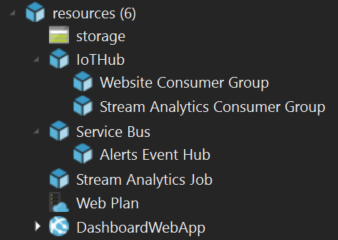

You can adapt the deployment of services in order to extend, optimize and customize your own ConnectTheDots solution.
The deployment of the ConnectTheDots solution is driven by the Azure Resource Manager.
Azure Resource Manager simplifies the deployment, maintenance and management of Azure resources. You can read about it extensively [here](https://azure.microsoft.com/en-us/documentation/articles/resource-group-overview/).
The ConnectTheDots.json file (in the same folder as this document) is the template used for ConnectTheDots deployment.
Below you will find a description of what's in the template and [here](https://azure.microsoft.com/en-us/documentation/articles/resource-group-authoring-templates/) you can read details about ARM templates syntax and formatting.

## Resources in the template ##
Here is what you will find in the template that will get deployed



- Storage:
  - The storage account is necessary for reading alerts from the Event Hub in the Website.
  - If you remove it then you won't be able to read alerts any longer.
- IoTHub:
  - The Azure IoT Hub service is your cloud gateway for devices.
  - This is the service that is used to securely connect devices to Azure IoT. When deploying the sevice using the ARM template, you will be prompted to select a SKU. You can choose to pick the free SKU which should be plenty enough for your ConnectTheDots solution (note that you can only deploy one of the free SKU of IoTHub per Azure subscription)
  - You cannot remove this service as it is core to the ConnectTheDots architecture.
- Service Bus:
  - This is the Service Bus instance that hosts the Event Hub used for alerts flow.
  - If you don't want to implement alerts or other alerts, you don't need this service and can comment it out. If you do so you will also have to customize the Website code that assumes this service is deployed.
- Stream Analytics Job:
  - This is the Stream Analytics job that does near real time analytics on the stream of data coming from devices (computing averages and triggering alerts)
  - You can customize the query as described in [this document](../StreamAnalyticsQueries/SA_Setup.md).
  - You can remove this service from the template with no impact on the rest of the solution (other than not having alerts triggered any more)
- Web Plan: 
  - This is the App Services plan for the Web dashboard.
  - If you remove this one, you won't be able to deploy the Website any longer
- DashboardWebApp
  - This is the Website dashboard
  - The site itself is deployed using a Webdeploy package. Read [here](../WebSite/WebsitePublish.md) if you want to customize and redeploy the site.

## Template walk through

    ```
    {
        "$schema": "http://schema.management.azure.com/schemas/2015-01-01/deploymentTemplate.json",
        "contentVersion": "1.0.0.0",
    // The parameters below are used to configure the deployment
        "parameters": {
            "iotHubSku": {
        // The SKU for the IoT Hub service is to be selected during deployment. F1 is for the free SKU (only one instance of the F1 SKU can be deployed per subscription)
        ...   
            },
            "iotHubTier": {
        // The tier for the IoT Hub instance is set by default to "Standard"
        ...
            },
            "packageUri": {
        // This URI is for the website WebDeploy package. The package is published by the ConnectTheDots team, but if you want your own package to be deployed, you can create it locally and change the below URI to point to it.
            "type": "string",
            "defaultValue": "http://aka.ms/connectthedotswebsitepackage"
            },
            "sbSku": {
        // The Service Bus SKU is set the cheapest available one by default
        ...
            },
            "solutionName": {
        // During deployment, you will be prompted for a solution name. This name is used as a prefix for naming the resource group and the various services. Use a unique name!
        ...
            },
            "storageAccountSku": {
        // The Storage account SKU is set the cheapest available one by default
        ...
            },
            "webSku": {
        // The Storage account SKU is set the cheapest available one by default
        ...
            },
            "webWorkerCount": {
        // This is used to scale the web plan. we only have one worker
        ...
            },
            "webWorkerSize": {
        // Set to the minimum available
            }   
        },
    // The variables below are used whithin the template deployment process and don't need to be changed...
        "variables": {
        ...
        },
    // Below is the list of resources that will be deployed
        "resources": [
            {
        // Storage account
            "apiVersion": "[variables('storageVersion')]",
            "location": "[variables('location')]",
            "name": "[variables('storageName')]",
        ...
            },
            {
        // IoT Hub
            "apiVersion": "[variables('iotHubVersion')]",
            "type": "Microsoft.Devices/Iothubs",
            "name": "[variables('iotHubName')]",
        ...
            },
            {
        // Service Bus + Event Hub (forthe alerts Event Hub)
            "apiVersion": "[variables('sbVersion')]",
            "name": "[variables('sbName')]",
        ...
            "resources": [
                {
        // Event Hub
                "apiVersion": "[variables('sbVersion')]",
                "name": "[variables('ehOutName')]",
                "type": "eventHubs",
        ...
                }
            ]
            },
            {
        // Stream Analytics job
            "apiVersion": "[variables('saVersion')]",
            "type": "Microsoft.StreamAnalytics/streamingjobs",
            "name": "[concat(parameters('solutionName'), 'alerts')]",
        ...
                "Transformation": {
                "Name": "AllToBlob",
        // Here is the inline default query that you can customize
                "Properties": {
                    "Query": "SELECT \r\n    'TempSpike' AS alerttype, \r\n    'Temperature over 80F' AS message, \r\n    displayname,\r\n    guid,\r\n    measurename,\r\n    unitofmeasure,\r\n    location,\r\n    organization,\r\n    MIN(timecreated) AS timecreated,\r\n    MAX(value) AS tempMax,\r\n    MAX(value) AS value\r\nINTO\r\n    DeviceInfoEvents\r\nFROM \r\n    IoTHubStream TIMESTAMP BY timecreated\r\nWHERE\r\n    measurename = 'temperature' OR measurename = 'Temperature'\r\nGROUP BY \r\n    displayname, guid, measurename, unitofmeasure, location, organization,\r\n    TumblingWindow(Second, 5)\r\n HAVING\r\n   tempMax > 80",
                    "StreamingUnits": 1
                }
                }
            }
            },
            {
        // Webplan
            "apiVersion": "[variables('webVersion')]",
            "name": "[variables('webPlanName')]",
            "type": "Microsoft.Web/serverfarms",
        ...
            },
            {
        // WebSite (deployed using webdeploy package
                "name": "[variables('webSiteName')]",
                "type": "Microsoft.Web/sites",
                "location": "[variables('location')]",
        ...
            }
        ],
    // The below are outputs printed at the end of the deployment for the user to have references such as connection strings
        "outputs": {
        ...
        }
    }
    ```