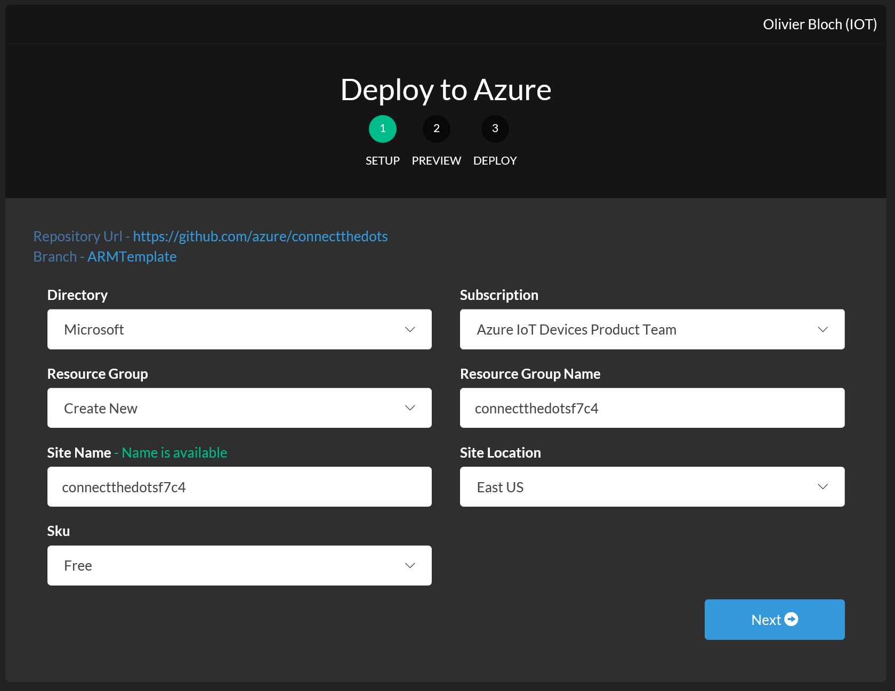
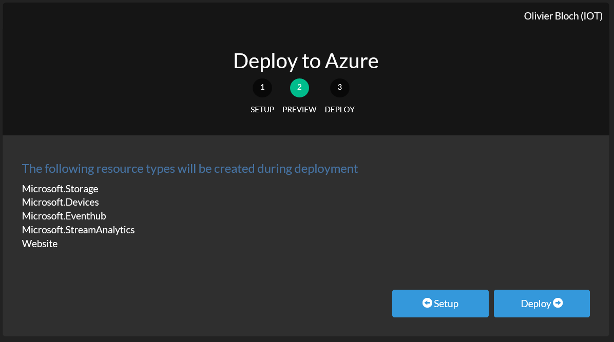
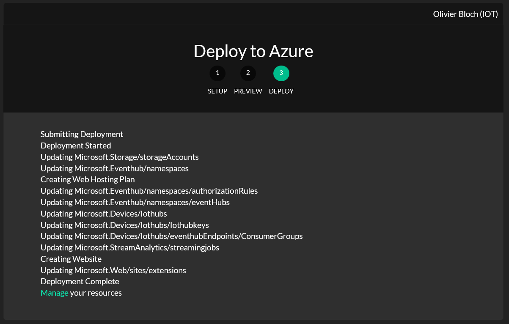

## How to deploy Azure services for ConnectTheDots.io
To deploy the ConnectTheDots solution to your Azure subscription you will need to follow the below instructions.
We are using Azure Resource Manager to deploy the needed services and connect them to one another.
We are also using the Azure cross platform CLI tool which will allow you to deploy the services from your favorite development machine, running Windows, Linux or OSX.
The below services will be deployed in your Azure subscription:
   - 1 instance of Azure IoT Hub (using the SKU of your choice, considering you can only deploy 1 instance of the free SKU per subscription)
   - 1 Storage account (Standard performance)
   - 1 Service Bus instance (Basic tier) with 1 Event Hub (1 throughput Unit)
   - 1 Stream Analytics Job (1 streaming unit)
   - 1 App Service plan (Standard: 2 Small SKU) with 1 Web app
   
You can edit the [ARM template](azuredeploy.json) if you want to add more services or edit the parameters. If you edit the ARM template manually, you will have to deploy it using the command line instructions, not the "Azure Deploy Button". 

The ConnectTheDots website can allow you to manage your IoTHub instance (get devices connection strings, add/remove devices). This feature is NOT enabled by default and requires manually configuration in Active Directory described [below](#enable-iothub-management).

## Your connect the dots resource groups
All the services will be deployed under a single resource group in Azure.
The [Azure resource groups](https://azure.microsoft.com/en-us/updates/resource-groups-in-azure-preview-portal/) are a concept allowing to manage a set of resources all together.
This allows you to easily find the various resources for your ConnectTheDots solution in the Azure portal.

## Editing the deployment ARM template
The default Azure Resource Manager template doesn't require editing unless you want to change the architecture of your solution to go from the default ConnectTheDots one to your own version of it.
You can find information on how to customize the ARM template for ConnectTheDots [here](CustomizeTemplate.md).
If you edit the template file, then you will have to deploy it using the command line instructions, not the "Azure Deploy Button"

## Deploy using the Azure Deploy Button
There are several ways to deploy Azure resources to your subscription using Azure Resourre Manager templates. The simplest one is to click on the button below and follow instructions.
If you prefer command line tools, skip to the next chapter.

[](https://azuredeploy.net/?repository=https://github.com/Azure/connectthedots/raw/IoTHubManagement/Azure/ARMTemplate)

Once you have clicked on the button, login to your subscription. You will be directed to the first step of the deployment: the setup.



Select the appropriate fields:
- Directory: this is the Azure Active Directory your account has access to and that you want to use
- Subscription: if you have several subscriptions, you can pick the one you want to deploy your solution to
- Resource group/Resource Group Name: the Azure resources/services will all be deployed to a single resource group, allowing for better management of the resources once deployed. You can choose to create a new resource group for your solution or deploy to an existing one.
- Region: pick the region you want to deploy your services to.
- Solution Name: this is the name for your connectthedots solution. This name has to be **all lower case** and **less than 16 characters**
- IoT Hub Sku: you can select F1 (free), S1 or S2 (see [here](https://azure.microsoft.com/en-us/pricing/details/iot-hub/) for details on pricing for these skus). Note that only 1 instance of the free SKU of IoT Hub is allowed per Azure subscription.
- AdminName: this is the user email you want to use as an admin if you want to activate the IoTHub management features in your site. **Use the email address you used to login into your Azure Subscription**

**Important**: the IoT Hub SKU selected by default is an S1 which has a cost (see pricing details link above). If you want to use the free tier, remember to switch the selection to F1. You will then be limited to 8K messages/day.
Once you have made your selections, click on **Next**



You can see the list of services that will be deployed.

Click on **Deploy**. You will see the progress of the deployment and if everything goes well, you will see this:



To access the resource group in the Azure portal directly, you can click on the green **Manage** link.

At this point you can go a start setting up your devices.

Read the chapter after next for instructions on how to clean up your Azure subscription once you are done playing with ConnectTheDots.

## Deploy using Azure CLI tool and the ARM template
Now here is how to deploy the whole ConnectTheDots solution in a few command lines:

1. Install the Azure CLI tool following the instructions [here](https://azure.microsoft.com/en-us/documentation/articles/xplat-cli-install/).
1. Once you have installed the Azure CLI, you will need to connect to your Azure account. To do so, follow the instructions [here](https://azure.microsoft.com/en-us/documentation/articles/xplat-cli-connect/).
1. If you have multiple subscriptions, select the one you want to deploy the solution to following the instructions [here](https://azure.microsoft.com/en-us/documentation/articles/xplat-cli-connect/#multiple-subscriptions) 
1. Set the Resource Azure Manager mode typing the following command:

   ```
   azure config mode arm
   ```

1. Create a new resource group typing the following command (you can replace "ConnectTheDotsRG" with the name of your choice for the resource group):

   ```
   azure group create -n "ConnectTheDotsRG" -l "East US"
   ```

1. Navigate to the Azure\ARMTemplate folder in the repo

   ```
   cd C:\My\Repo\Location\Azure\ARMTemplate
   ```

1. Deploy the solution typing the below command. You will actually be prompted for the following:

   * region: you can use one of the following: "East US", "West US", "North Europe", "West Europe", "East Asia", "South East Asia", "Japan East", "Japan West", "Australia East", "Australia SouthEast", "North Europe"
   * iothub SKU:  you can select F1 (free), S1 or S2 (see [here](https://azure.microsoft.com/en-us/pricing/details/iot-hub/) for details on pricing for these skus). Note that only 1 instance of the free SKU of IoT Hub is allowed per Azure subscription.
   * solution name: this name has to be **all lower case** and **less than 16 characters**
   * AdminName: this is the user email you want to use as an admin if you want to activate the IoTHub management features in your site.

   ```
   azure group deployment create -f "azuredeploy.json" ConnectTheDotsRG ConnectTheDotsDeploy 
   ```

1. If you are seeing errors during the deployment, you can diagnose following instructions on how to debug ARM deployments: [http://aka.ms/arm-debug](http://aka.ms/arm-debug).

## Enable IoTHub Management
The ConnectTheDots website can allow you to manage your IoT Hub instance: create/delete devices in the IoT Hub device registry, retreive connection strings.
In order to ensure this is a secured process, you will need to create a new Azure Active Directory application and register your instance of the website to enable the features.
But keep cool, there is a simple process for this:

1. Go to the [Azure portal](https://portal.azure.com)
1. Look for the resource group created during the deployment of the solution
1. Select the website in the list of resources to bring up the website blade
1. In the Settings section, look for and click on "Authentication/Authorization"
1. Turn "App Service Authentication" to on
1. Select "Log in with Azure Active Directory" in the "Action to take when request is not authenticated"
1. Click on the Azure Active Directory provider to configure it
1. Select "Express" and "Create new AD App", then click OK
1. Save the new Authentication/Authorization setting

Once you have done so you can go back to the site where you will be prompted to login. Use the same account as your Azure Subscription's one. There you should see a new collumn in the devices list as well as a couple buttons allowing you to create a new device or delete an existing one.
No more need to toy around with IoTHub in the portal!

## Deleting a ConnectTheDots solution from your Azure subscription
You can easily delete all the Azure resources at once when you are done with your project and want to clean up your Azure subscirption.
You can do this using a command line in the Azure CLI tool or in the Azure portal.

## Delete the resources using Azure CLI
If you are already logged in in the Azure CLI tool, go directly to step #4

1. Connect to Azure following the instructions [here](https://azure.microsoft.com/en-us/documentation/articles/xplat-cli-connect/).
1. If you have multiple subscriptions, select the one you want to deploy the solution to following the instructions [here](https://azure.microsoft.com/en-us/documentation/articles/xplat-cli-connect/#multiple-subscriptions) 
1. Set the Resource Azure Manager mode typing the following command:

   ```
   azure config mode arm
   ```

1. Delete the resource group typing the following command (you need to replace "ConnectTheDotsRG" with the name you used in step 5 of the deployment if you changed it):

   ```
   azure group delete -n "ConnectTheDotsRG"
   ```
