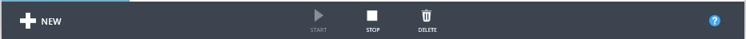
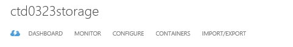
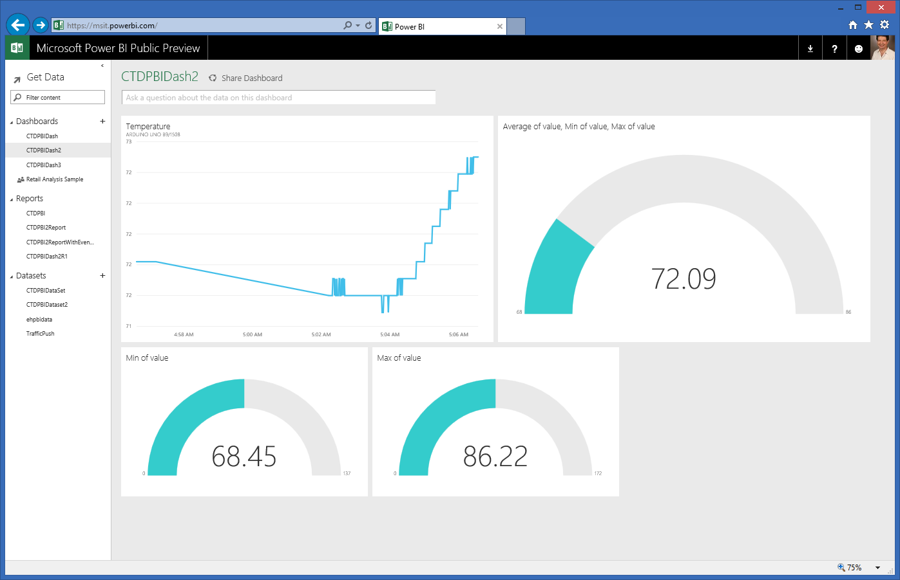

The instructions below will help you setup a Power BI dashboard in the Connect The Dots starter solution, but they can be adapted as necessary for other scenarios. This document assumes you have already deployed the starter solution with at least one device set up pushing data to an Azure Event Hub. The documentation below uses the names and fields you would have if you had set up the starter solution with an Arduino Weather Shield, but can be modified as needed if you have a different sensor or named your fields and hubs differently.

## Prerequisites ##

Make sure you have a working starter solution, with data showing in your Azure website. In addition, you will need a Power BI account, for which you can sign up for the Public Preview at [PowerBI.com](http://www.PowerBI.com).

## Create a Service Bus Consumer Group ##

To make sure you do not exceed the maximum number of readers on your Connect The Dots Event Hub, create a Consumer Group first.

* Open the Azure Management Portal, and select Service Bus
* Select the Namespace you used for your solution
* From the top menu, select Event Hubs
* From the left menu, select ehdevices
* From the top menu, select Consumer Groups
* Select "+" Create at the bottom to create a new Consumer Group
* Give it the name "CG4PBI" and click OK

## Create an Azure Stream Analytics (ASA) job ##

* Make sure you have access to the  ASA preview. If you don’t, sign up at  [https://account.windowsazure.com/PreviewFeatures ](https://account.windowsazure.com/PreviewFeatures )

* Create a job
	* Open the Azure Management Portal, and create a new job “CTD2PBI”:
	* Click "+” in lower left corner, and select Data Services -> Stream Analytics -> Quick Create -> Job name “CTD2PBI”.
      
	* Select the job to bring up the job view:
	* 

* Create an input
    * Select the INPUTS tab 
    * Select Add an Input -> Data Stream, Event Hub
    * Input Alias: “DevicesInput”
    * Subscription: “Use Event Hub from Current Subscription”
    * Choose the namespace `<name>`-ns, where `<name>` is the name you created when running AzurePrep.exe previously to create the Event Hubs
    * Event Hub “ehdevices”
    * Policy Name: “StreamingAnalytics”
    * Consumer Group: "cg4pbi"
    * Serialization: JSON, UTF8
    * 

* Create a query 
    * Select the QUERY tab 
    * Copy/paste contents “cg4pbi.sql” found in the ConnectTheDots\Azure\StreamAnalyticsQueries folder in Windows Explorer
    * Save
    * 
* Create an output to test the query
	* Select the Outputs tab
    * Select Add an Output -> Blob storage
    * Under Blog Storage Settings enter:
		* Output Alias: "output"
		* Subscription: Use Storage Account from Current Subscription"
		* Choose a Storage Account: <name>
		* Storage Container: "Create a new storage container:
		* Container: "ehresults"
		* Filename prefix: "ctdtest"
	* Under Serialization settings choose:
		* Event Serialization format: CSV
		* Delimiter: comma (,)
		* Encoding UTF8
		* 
* Create an output for Power BI
	* Select the Outputs tab
    * Select Add an Output -> Power BI
	* Select either "Existing Microsoft Power BI User" if you have an account and click "Authorize Now" or click "Sign up now" for a new Power BI account.
	* Under Microsoft Power BI Settings enter:
		* Output Alias: "CTDPBI"
		* Dataset Name: "CTDPBIDataSet"
		* Table Name: "CTDPBITable"

* Start the Job
    * Dashboard, Start. Select Job Start Time for Start Output.

## Check the output of the SQL query ##
* Download the results of the query
	* Open the Azure Management Portal, and select STORAGE
	* Select the storage account name for your project
	* 
	* Select CONTAINERS from the top menu
	* Select "ehresults" in the right pane
	* Select the most recent result in the right pane, and click DOWNLOAD in the menu at the bottom:
	* 
	* Select a location to store the CSV file
* Review the data in the CSV file from local storage to make sure that you have the right output from your Stream Analytics query.
* If the output looks correct, you can go back and delete the output you created to test the query.

## Create a Power BI dashboard ##
###Create a dashboard###
We are going to create a Power BI dashboard for a the data coming from the Connect The Dots starter solution, of a single Arduino UNO + Weather Shield sending data to an Azure Event Hub. The finished product will look something like this:

To create this, first create a dashboard:

* Log in to [http://App.PowerBI.com](http://app.powerbi.com)
* Create a Dashboard for your Connect The Dots data
	* Click "+" in the left menu under Dashboards
	* Enter a name: "CTDPBIDash"
* Click Save
###Create your first chart###
The first chart on your dashboard will be a real-time timeline showing the temperature from your sensor. To create this, follow these steps in order:

* Select a dataset from the Datasets shown in the left nav menu.  
	* Select "CTDPBIDataSet". This contains the same data as you saw in the CSV file you downloaded above, but in JSON format.
* Select fields for the first chart on the dashboard. 
	* Select "timecreated" in the right pane under Fields, and wait till the chart is showing
	* Select "displayname", and wait till the chart is updated.
* Create a filter for any chart on this page to show only temperature
	* Drag "measurename" over the word Filters
	* Click PAGE in the right pane, under Filters
	* Select
	* "Temperature"
* If you have multiple sensors that you have added to the same event hub, you can create a filter for this chart to show one or more of them - 
	* Click on Fields
	* Click on Filters again 
	* This time, click CHART in the right pane 
	* Click on "displayname"
	* Select your (or one of your) sensors
* Save the chart
	* Click SAVE in the left pane
	* Enter a name: "CTDPBIReport"
* Pin the chart to your dashboard
	* Select the chart
	* Click the Pin It icon. On the top right you should see a confirmation message that it has been pinned to your dashboard.
* Format the presentation of the chart on the dashboard
	* Click CTDPBIDash on the top menu bar to see the real time chart on your dashboard.
	* Hover over the chart (do not click it), and select the Edit (pencil) icon. 
	* Enter Title data
		* 1st line: Temperature
		* 2nd line: the name of your sensor
		* Hit Enter 
	* Use the mouse to size the chart on your dashboard

###Create a second chart###
The second chart will be a gauge showing the minimum temperature for that sensor. Follow these steps:

* Create a new page on the report similar to the first page 
	* Click the plus sign in the left pane. This creates a second page.
	* Select the second page in the left pane
* Create a duplicate chart to the first
	* Follow the steps above for the first chart to add the temperature, display name, and page/chart filters
* Change the chart type
	* On the right of the chart, select Change Visualization Type
	* Near the bottom, select Gauge
* Customize the gauge
	* Click on Fields
	* Change Value from Sum to Min of Value 
	* Pin the chart with the minimum to the dashboard
* Customize the gauge again
	* Change Value from Min of Value to Average of Value
	* Drag value from CTDPBITable down to Maximum Value box, and change to Max of value using drop down.
	* Drag value from CTDPBITable down to Minimum Value box, and change to Min of value using drop down.
	* Pin it
* Customize the gauge a third time
	* Change the Value from Average to Maximum
	* Pin it
* Save this report
	* Click SAVE in the left pane

### Finish up the dashboard###
* Customize the appearance of your dashboard
	* Select the chart
	* Click the Pin It icon. On the top right you should see a confirmation message that it has been pinned to your dashboard.
* Format the presentation of the chart on the dashboard
	* Click CTDPBIDash on the top menu bar to see the real time chart on your dashboard.
	* Hover over the chart (do not click it), and select the Edit (pencil) icon. 
	* Enter Title data
		* 1st line: Temperature
		* 2nd line: the name of your sensor
		* Hit Enter 
	* Use the mouse to size the chart on your dashboard

