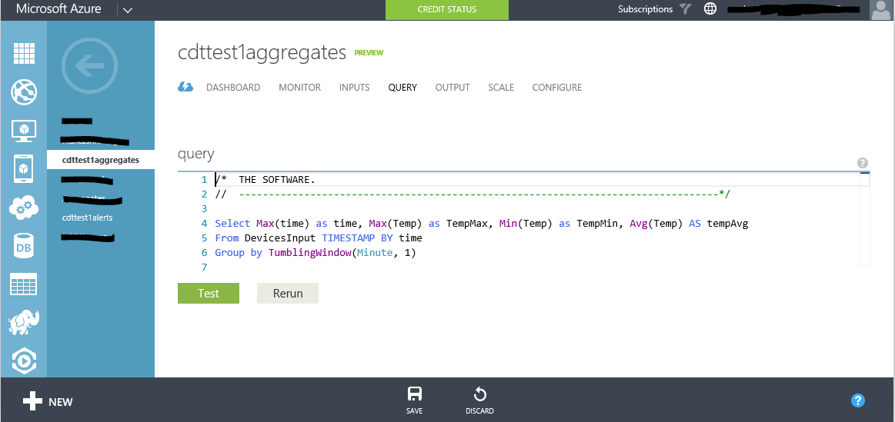

The instructions below will help you setup the Stream Analytics queries in the Connect The Dots starter solution, but they can be adapted as necessary for other scenarios. This document assumes you have all the necessary software and subscriptions and that you cloned or downloaded the ConnectTheDots.io project on your machine.

## Prerequisites ##

Make sure you have all software installed and necessary subscriptions as indicated in the Readme.md file for the project. To repeat them here, you need

1. Microsoft Azure subscription ([free trial subscription](http://azure.microsoft.com/en-us/pricing/free-trial/) is sufficient)
1. Access to the [Azure Streaming Analytics Preview](https://account.windowsazure.com/PreviewFeatures)
1. Visual Studio 2013 – [Community Edition](http://www.visualstudio.com/downloads/download-visual-studio-vs)

Note also that these queries are hard-coded to the data streams defined in the "starter kit" in this project, meaning the same JSON string contents, etc. Also note that the SQL queries ARE CASE SENSITIVE, so that "temperature" <> "TEMPERATURE". You should make sure that the spelling and case of the incoming measure names are the same as in the SQL queries.

## Create three Azure Stream Analytics (ASA) jobs ##

* Make sure you have access to the  ASA preview> If you don’t, sign up at  [https://account.windowsazure.com/PreviewFeatures ](https://account.windowsazure.com/PreviewFeatures )
* Create the first job
    * Open the Azure Management Portal, and create a new job “Aggregates”:
        * "+” in lower left corner -> Data Services -> Stream Analytics -> Quick Create -> Job name “Aggregates”.
    * Create an input
        * Select the Inputs tab in the Aggregates job.
            * Inputs tab -> Add an Input -> Data Stream, Event Hub
        * Input Alias: “DevicesInput”
        * Subscription: “Use Event Hub from Current Subscription”
        * Choose the namespace `<name>`-ns, where `<name>` is the name you created when running AzurePrep.exe previously to create the Event Hubs
        * Event Hub “ehdevices”
        * Policy Name: “StreamAnalytics”
        * Serialization: JSON, UTF8
    * Create a query 
        * Select the Query tab in the Aggregates job
        * Copy/paste contents “Aggregates.sql” found in the ConnectTheDots\Azure\StreamAnalyticsQueries folder in Windows Explorer
        * Save
        * 

    * Create an output
        * Select the Output tab in the Aggregates job
            * Output tab -> Add an Output, Event Hub,
		* Choose the namespace <name>-ns, 
        * Event Hub “ehdevices”
        * Policy name “StreamAnalytics”
        * Serialization “JSON”, UTF8
    * Start the Job
        * Dashboard, Start
* Create a second job “Alerts”: as above, but use “alert.sql” contents for the query, and use "ehalerts" for the Output Event Hub, not "ehdevices".
* Create a third job “LightSensor”: as above, but use “lightsensor.sql” contents for the query, and use "ehalerts" for the Output Event Hub.