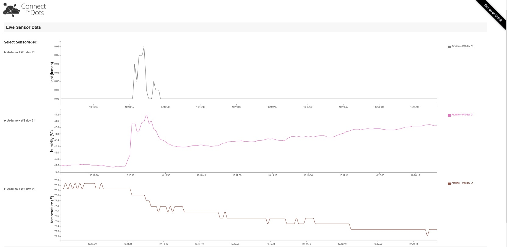

# Website Publish #
This document explains how to build and deploy a sample website that is used to show data and alerts in the Connect The Dots project. It assumes you have all necessary software and subscriptions and that you have cloned or download the ConnectTheDots.io project on your machine.

## Prerequisites ##

Make sure you have all software installed and necessary subscriptions as indicated in the Introduction.md file for the project. To repeat them here, you need

1. Microsoft Azure subscription ([free trial subscription](http://azure.microsoft.com/en-us/pricing/free-trial/) is sufficient)
1. Access to the [Azure Streaming Analytics Preview](https://account.windowsazure.com/PreviewFeatures)
1. Visual Studio – [Community Edition](http://www.visualstudio.com/downloads/download-visual-studio-vs)

## Configure Web.config
In order for the website publishing to work, you must have run the AzurePrep program discussed in the [getting started](../../GettingStarted.md) project, as it creates the event hubs from which the website pulls data, as well as populates the `web.config` file that is published for the Azure website.

If you have the `web.config` file from AzurePrep, all you need to do is add it to the Website project.

If you already have the event hubs and are simply republishing a website, you can just edit the `web.config` file manually before publishing. To do this, open `ConnectTheDots\Azure\WebSite\ConnectTheDotsWebSite\web.config` and find the lines

    <add key="Microsoft.ServiceBus.EventHubDevices" value="ehdevices" />
    <add key="Microsoft.ServiceBus.EventHubAlerts" value="ehalerts" />
    <add key="Microsoft.ServiceBus.ConnectionString" value="Endpoint=sb://{namespace-name}.servicebus.windows.net/;SharedSecretIssuer=owner;SharedSecretValue={key}" />
    <add key="Microsoft.ServiceBus.ConnectionStringDevices" value="Endpoint=sb://{namespace-name}.servicebus.windows.net/;SharedAccessKeyName=WebSite;SharedAccessKey={key}" />
    <add key="Microsoft.ServiceBus.ConnectionStringAlerts" value="Endpoint=sb://{namespace-name}.servicebus.windows.net/;SharedAccessKeyName=WebSite;SharedAccessKey={key}" />
    <add key="Microsoft.Storage.ConnectionString" value="DefaultEndpointsProtocol=https;AccountName={storageaccount};AccountKey={key}" />

You will need to replace the last four connection strings with the appropriate values for your subscription, found in [https://manage.windowsazure.com](https://manage.windowsazure.com) as follows:

1. **ServiceBus.ConnectionString**. Select Service Bus from the left nav menu, highlight the Namespace Name created earlier, click on Connection Information at the bottom of the screen, and copy the RootManagedSharedAccessKey.
2. **ServiceBus.ConnectionStringDevices**. Select Service Bus from the left nav menu, select the Namespace Name created earlier, highlight ehdevices, click on Connection information at the bottom of the screen, and copy the WebSite Connection string.
3. **ServiceBus.ConnectionStringAlerts**. Select Service Bus from the left nav menu, select the Namespace Name created earlier, highlight ehalerts, click on Connection information at the bottom of the screen, and copy the WebSite Connection string.
4. **Storage.ConnectionString**. Select Storage from left nav menu, highlight the storage account created earlier, click on Manage Access Keys at the bottom of the screen, and copy the Primary Access Key.

## Publish the Azure Website ##

* Open the `ConnectTheDots\Azure\WebSite\ConnectTheDotsWebSite.sln` solution in Visual Studio
* Make sure the `web.config` file has been updated
	* If you made you're own updates, verify they are present.
	* If you are using the `web.config` from AzurePrep, copy it to the project directory, then right click on the project navigate to *Add > Existing item...* and add it to the project.
* In VS, Right-click on the project name and select *Publish*.
* Select Azure Web Sites, create new one. 
    * Site name: [pick something unique]
    * Region: [pick same region as you used for Stream Analytics]
    * Database server: no database
    * Database password: [leave suggested password]
* Publish (you might need to install WebDeploy extension if you are having an error stating that the Web deployment task failed. You can find WebDeploy [here](http://www.iis.net/downloads/microsoft/web-deploy)).

## Websockets setting ##
* Enable WebSockets for the new Azure Web site
    * Browse to https://manage.windowsazure.com and select your Azure Web Site.
    * Click on the Configure tab. Then set WebSockets to On and Click "Save"
	
##Running the site
* Open the site in a browser to verify it has deployed correctly. 
    * At the bottom of the page you should see “Connected.”. If you see “ERROR undefined” you likely didn’t enable WebSockets for the Azure Web Site (see above section).

**Note** There is a chance you won't see any data coming into your site when you first stand it up.  If that is the case, try rebooting your gateway.

If you're following the getting started project, the next task is [Stream Analytics integration](../StreamAnalyticsQueries/SA_setup.md).
