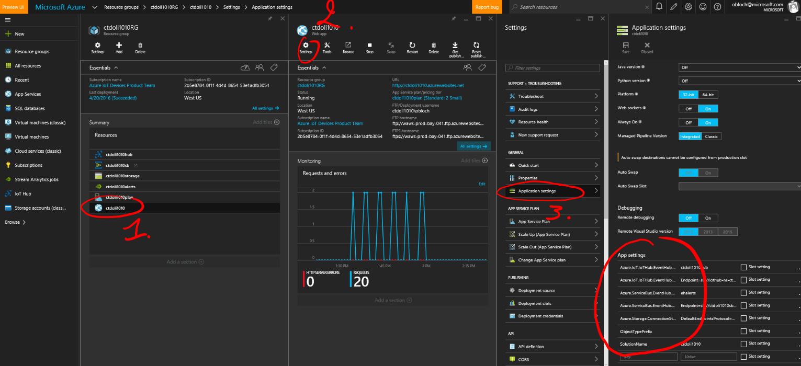

# Website parameters and re-publish #
This document explains how to build and deploy a sample website that is used to show data and alerts in the Connect The Dots project. It assumes you have all necessary software and subscriptions and that you have cloned or download the ConnectTheDots.io project on your machine.

Since the version 2 of ConnectTheDots, the deployment of the site is primarily done using an ARM template (see [here](../ARMTemplate/Readme.md) for details) and there is no need for manually deploying if you are just using the default dashboard site and solution architecture.
If you want to make changes to the site though or have changed the Azure services architecture (changed Event Hub or IoT Hub) you will need to redeploy the site. 

## Web app parameters
In order for the website to connect with the various Azure resources (IoT Hub, Event Hub), it needs to have information about these services such as connection strings and credentials.
The ARM Template used to deploy the Azure services populates these parameters so you don't have to do it manually.
If you are willing to change these parameters (for example if you have decided to use a different IoT Hub), you can find them in the Azure portal:

- Go to [portal.azure.com](http://portal;.azure.com)
- Login using your Azure account credentials
- Find the resource group that was deployed for your ConnectTheDots solution when following the [instructions](../ARMTemplate/Readme.md).
- Once you have selected the resource group:
   1. Identify and select the Web App
   1. Click on the **settings** button in the Web App blade
   1. Select **Application settings**
   1. Scroll down to **App settings**

 

Once you have made your edits in the settings, you can just restart the site, clicking on the **Restart** in the Web App blade

## Modifying the dashboard Website ##
### Prerequisites ###
Make sure you have all software installed and necessary subscriptions as indicated in the ReadMe.md file for the project. To repeat them here, you need

1. Microsoft Azure subscription ([free trial subscription](http://azure.microsoft.com/en-us/pricing/free-trial/) is sufficient)
1. Visual Studio – [Community Edition](http://www.visualstudio.com/downloads/download-visual-studio-vs)
1. Deploy the default dashboard Website a first time using the [ARM Template](../ARMTemplate/Readme.md).

## Publish the Azure Website ##

* Open the `ConnectTheDots\Azure\WebSite\source\ConnectTheDotsWebSite.sln` solution in Visual Studio
* In VS, Right-click on the project name and select *Publish*.
* In the Profile tab, select the publish target **Microsoft Azure Web Apps**
* Select your subscription
* Select the resource group for your ConnectTheDots deployment
* Select the Web App below then click **OK**
* Click on **Publish**
	
##Running the site
* Open the site in a browser to verify it has deployed correctly. 
    * At the bottom of the page you should see “Connected.”. If you see “ERROR undefined” you likely didn’t enable WebSockets for the Azure Web Site (see above section).

**Note** There is a chance you won't see any data coming into your site when you first stand it up.  If that is the case, try rebooting your gateway.

