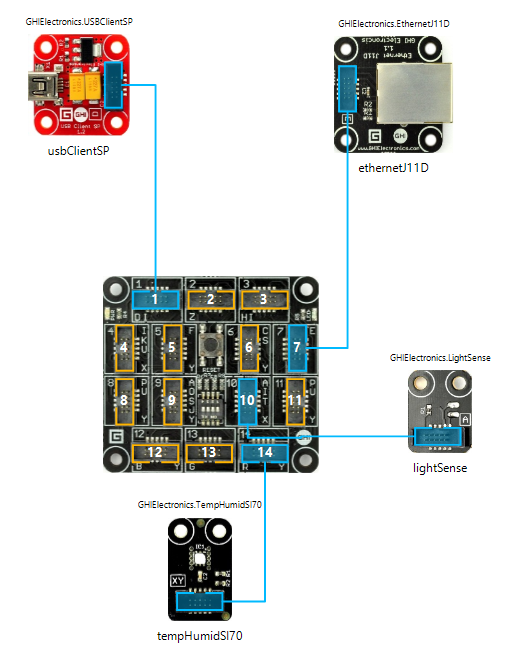
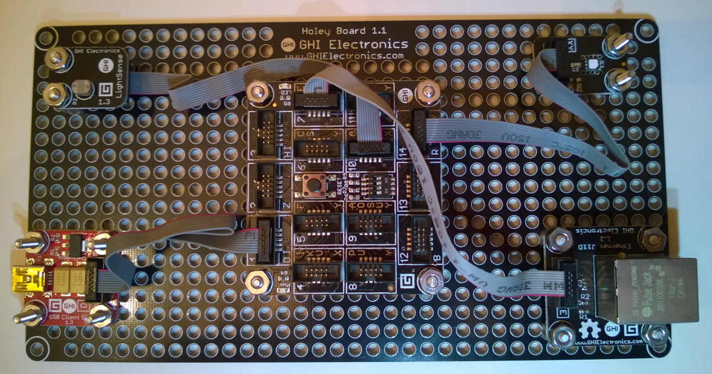
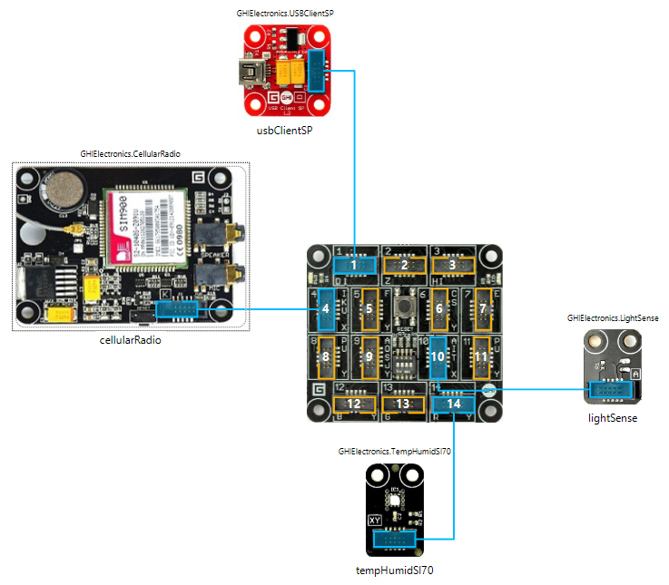
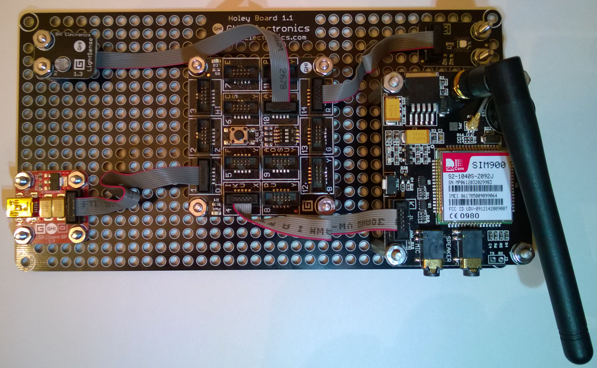

This Wiki explains how to setup a Gadgeteer board running .NET MicroFramework to send temperature and humidity data to Microsoft Azure to do analytics and display real time data as well as alerts.
It assumes that you have all the necessary hardware and tools installed (see below)

##Hardware requirements

The hardware listed below is the one used to test the code. You can try with an other board and adapt the code to the hardware differences (different sensors on different pins, different network connection,...). Important note: you will need a hardware that is SSL capable as the connection with Azure services is established using a secured SSL connection. Not all .NET Micro Framework mainboards are SSL capable.

Suitable SSL Supported Gadgeteer Mainboards

 - [Gadgeteer FEZ Spider Mainboard][1] 
 - [Gadgeteer FEZ Spider II Mainboard][2] 
 - [Gadgeteer FEZ Raptor Mainboard][3] 

Sensors and power modules

 - [Gadgeteer USB SP Module][4] 
 - [Gadgeteer TempHumid S170 Module][5] 
 - [Gadgeteer LightSense Module][6] 

Networking options

 - [Gadgeteer Ethernet J11D Module][7] #define (ETHERNET) in the code
 - [Gadgeteer WiFi RS21 Module][8] #define (WIFI) in the code
 - [Gadgeteer Cellular Module][9] #define (CELLULAR) in the code


##Software and tools requirements

You will need to install the below software in this order to implement this .NET Micro Framework sample.

 - Visual Studio 2013 ([Community Edition][10] works fine)
 - [.Net Micro Framework Core SDK][11]
 - [.Net Gadgeteer Core][12]
 - [GHI NETMF and Gadgeteer package][13]

##VS Solution

* Open the Visual Studio Solution for the .NET Micro Framework sample, located in the repo ConnectTheDots\devices\NETMF\ConnectTheDotsGadgeteer.sln.

* Open the program.cs file and edit the 6 lines below to configure the AMQP connection to Event Hub using the information you got when setting up the Azure services using the ConnectTheDotsCloudDeploy tool. For the device name, guid, organization and location, pick one of your choosing.

```
const string AMQPAddress = "amqps://{key-name}:{shared-key}@{namespace}.servicebus.windows.net";
const string EventHub = "{EventHub-name}";
const string SensorName = "{sensor-name}";
const string SensorGUID = "{xxxxxxxx-xxxx-xxxx-xxxx-xxxxxxxxxxxx}";
const string Organization = "{organization}";
const string Location = "{location}";
```

* Once you have applied these changes to the code, connect the red USB power module, temperature & humidity sensor, the Ethernet or Wifi or Cellular Module to the Gadgeteer FEZ mainboard as shown in designer.

Sample configurations shown below:

Ethernet





WiFi


Cellular





* if using an Ethernet module connect the Ethernet Module to an Ethernet cable connected to a network with DHCP, connect the USB cable from your PC to the USB DP Module.  If the output windows shows a connection of 0.0.0.0 you may need to unplug and replug the Ethernet cable.

* if using a WiFi module enter the SSID and password into the appropriate place holders in the code.

* if using a Cellular module insert the SIM Card into the holder on the bottom of the Cellular Module and enter your APN, UserName and Password into the appropriate place holders in the code.

* When hitting F5 in Visual Studio, the Gadgeteer board will be flashed with your program and will start sending its temperature and humidity data to Azure services.

If you are having issues with the Gadgeteer board, check out the [troubleshooting guide][14] from GHI Electronics. 

If you are hitting an exception when running the application on your board in the InitAMQPConnection function when the new Connection call is made (see below), this probably means you need to update the SSL seed on your board, with the MFDeploy.exe tool using the Target|ManageDeviceKeys|Update SSL Seed menu.


    // Initialization of AMQP connection to Azure Event Hubs
    private void InitAMQPconnection()
    {
        // Get the Event Hub URI
        address = new Address(AMQPAddress);
    
        // create connection
        connection = new Connection(address);
    
        // create session
        session = new Session(connection);
    
        // create sender
        sender = new SenderLink(session, "send-link", EventHub);
    }

You might also want to adjust the LightSensor.sql for the Stream Analytics LightSensor to something like:
 
    SELECT 
        'LightSensor' as alerttype, 
        'The Light is turned OFF' as message,
        displayname,
        guid,
        measurename,
        unitofmeasure, 
        location,
        organization,
        MIN(timecreated) AS timecreated,
        max(value) as value
    FROM 
        DevicesInput TIMESTAMP BY timecreated
    WHERE
        measurename = 'light' OR measurename = 'Light'
    GROUP BY 
        displayname, guid, measurename, unitofmeasure, location, organization,
        TumblingWindow(Second, 40)
    HAVING 
        avg(value) < 0.2 and count(*) > 3

And the Stream Analytics Temperature Alert query to something like:

    SELECT 
        'TempSpike' AS alerttype, 
        'Temperature over 80F' AS message, 
        displayname,
        guid,
        measurename,
        unitofmeasure, 
        location,
        organization,
        MIN(timecreated) AS timecreated,
        MAX(value) AS tempMax,
        MAX(value) AS value
    FROM 
        DevicesInput TIMESTAMP BY timecreated
    WHERE
        measurename = 'temperature' OR measurename = 'Temperature'
    GROUP BY 
        displayname, guid, measurename, unitofmeasure, location, organization,
        TumblingWindow(Second, 30)
    HAVING 
        tempMax > 80

And the Stream Analytics Aggregates query to:

    SELECT
        measurename,
        unitofmeasure,
        'All Sensors' AS location,
        'All Sensors' AS organization,
        'ace60e7c-a6aa-4694-ba86-c3b66952558e' AS guid,
        'Temp Average' as displayname,
        Max(timecreated) as timecreated,
        Avg(value) AS value
    FROM
        DevicesInput TIMESTAMP BY timecreated
    WHERE
        measurename = 'temperature' OR measurename='Temperature'
    GROUP BY
        measurename, unitofmeasure,
        TumblingWindow(Second, 30)

To accommodate the 10 second data upload speeds so that you get proper alerts etc.


A good user forum to ask questions and receive answers about .NetMF or Gadgeteer can be found [here][15].

Additional sample Gadgeteer projects complete with source code can be found [here][16].

  [1]: https://www.ghielectronics.com/catalog/product/269
  [2]: https://www.ghielectronics.com/catalog/product/432
  [3]: https://www.ghielectronics.com/catalog/product/499
  [4]: https://www.ghielectronics.com/catalog/product/330
  [5]: https://www.ghielectronics.com/catalog/product/528
  [6]: https://www.ghielectronics.com/catalog/product/336
  [7]: https://www.ghielectronics.com/catalog/product/284
  [8]: https://www.ghielectronics.com/catalog/product/282
  [9]: https://www.ghielectronics.com/catalog/product/322
  [10]: http://go.microsoft.com/fwlink/?LinkId=517284
  [11]: http://netmf.codeplex.com/downloads/get/1423115
  [12]: https://gadgeteer.codeplex.com/downloads/get/918081
  [13]: https://www.ghielectronics.com/download/sdk/36/ghi-electronics-netmf-sdk-2015-r1-pre-release-3
  [14]: https://www.ghielectronics.com/docs/165/netmf-and-gadgeteer-troubleshooting
  [15]: https://www.ghielectronics.com/community/forum
  [16]:  https://www.ghielectronics.com/community/codeshare
