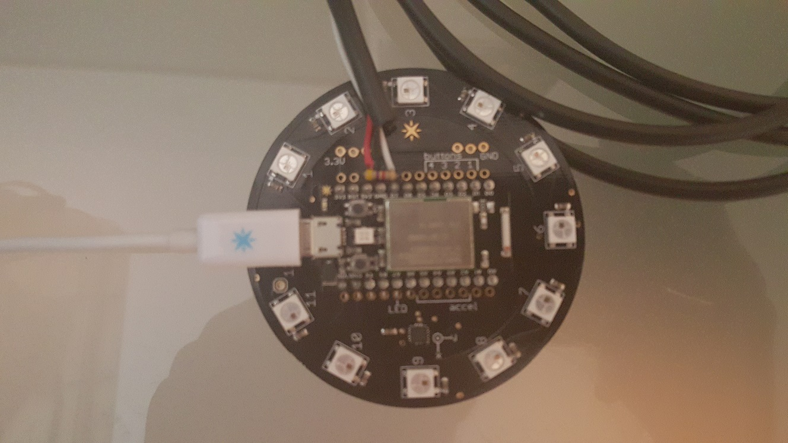
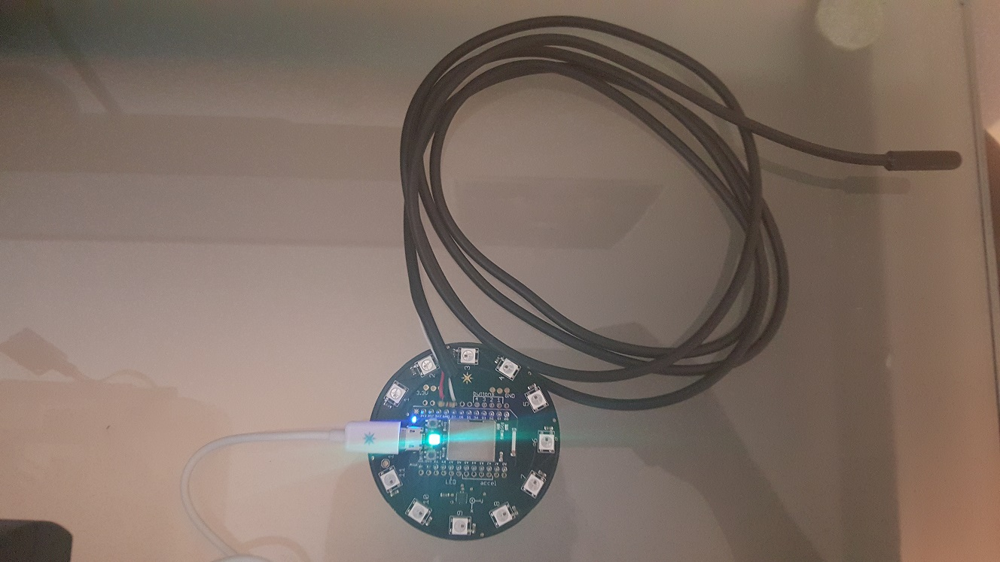

## Particle+DS18B20 Setup ##
This wiki will describe how to connect the DS18B20 sensor to your Particle Core and upload the code to connect it to your ConnectTheDots Event Hub.  Using the Particle Button, we will give color feedback on the temperature from the device itself, in addition to publishing the temperature data to a ConnectTheDots Event Hub.

## Prerequisites ##
Ensure that you have completed  setting up the [Particle Webhook](https://github.com/MSOpenTech/connectthedots/blob/master/Devices/DirectlyConnectedDevices/ParticleCore/ParticleWebHook/ParticleWebHook-Setup.md) and [ConnectTheDots EventHub Deployment](https://github.com/toolboc/connectthedots/blob/master/Azure/AzurePrep/AzurePrep.md)

## Hardware Requirements ##
[Particle Core Device](https://store.particle.io/?product=particle-core)

[DS18B20 Sensor with 4.7k Resistor](http://www.adafruit.com/products/381)

[Particle Button](https://www.particle.io/button)

Soldering Iron / Solder

## Wiring Instructions ##

With the DS18B20 sensor in hand, solder VDD (Red Wire) to 3v3, GND (Black Wire) to GND, and D (White Wire) to D7 on the Particle Button board.  You will then want to connect a 4.7k Ohm resistor between VDD and D.  It is recommended that you perform the soldering while the Particle Core is detached from the Particle Button board.  For more details on this circuit, see [ContractorWolf's - The Particle Core IOT Temperature Sensor with the DS18b20](http://contractorwolf.com/particlecore-temp-ds18b20/).  The finished product should resemble the images below:

## Code Deployment ##
Ensure your Particle Core is configured for deployment by following this [Instructable](http://www.instructables.com/id/Getting-a-Spark-Core-running-without-using-Sparks-/).

[Login to the Particle IDE](https://build.particle.io/build) and create a new project.

Add the SPARKBUTTON library by following the [Flash apps with Particle Build Using Libraries Documentation](http://docs.particle.io/build/#flash-apps-with-particle-build-using-libraries).

Manually create 2 custom libraries by clicking the "+" to the far right of the Particle Web IDE.  Name  the first "DS18B20" and the second "OneWire".  This will create a DS18B20.cpp, DS18B20.h, OneWire.cpp, and OneWire.h file within the Particle IDE. Once these have been created, copy and paste in the contents for each respective file from the [Particle+DS18B20 Repo](https://github.com/MSOpenTech/connectthedots/blob/master/Devices/DirectlyConnectedDevices/ParticleCore/Particle+DS18B20).

Within the .ino of your newly created project, paste in the following [code](https://github.com/MSOpenTech/connectthedots/blob/master/Devices/DirectlyConnectedDevices/ParticleCore/Particle+DS18B20/Particle+DS18B20.ino).

Update the following variables:

    char Org[] = "ORGANIZATION_NAME";
    char Disp[] = "DISPLAY_NAME";
    char Locn[] = "LOCATION";

Verify and Deploy to your Particle Core!
