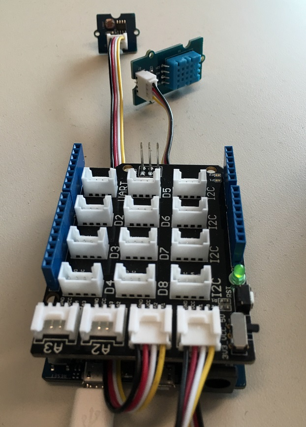

# Setup Arduino and Weather Shield #
This document explains how to setup an Arduino Zero with a Seeed Gove shield for monitoring temperature, humidity and light level in the Connect The Dots getting started project. It assumes that you have the right tools installed and that you have cloned or downloaded the ConnectTheDots.io project on your machine.

##Hardware requirements ##
You need an [Arduino Zero](https://www.arduino.cc/en/Main/ArduinoBoardZero), a [Seeed Grove shield](http://www.seeedstudio.com/wiki/Grove_-_Base_Shield), a [Grove Light Sensor](http://www.seeedstudio.com/wiki/Grove_-_Light_Sensor), and a [Grove Temperature sensor](http://www.seeedstudio.com/wiki/Grove_-_Temperature_and_Humidity_Sensor).

This sample should work unmodified with an [Arduino Uno](https://www.arduino.cc/en/Main/ArduinoBoardUno). There are comments in the code showing some changes you can make to use floating point rather than int with the Uno owing to some library differences.

##Prepare the Arduino Uno R3 ##

* Connect the Arduino Zero directly to your computer with the USB cable
* Install and run the Arduino IDE (we recommend the current official release, with the Windows Installer) which you can find on the [Arduino.cc](http://arduino.cc/en/Main/Software) website.
* If necessary, install the Windows device drivers for the Arduino on your computer, following the instructions [here](http://arduino.cc/en/Guide/Windows#toc4).
* Get the necessary libraries, in the Arduino IDE go to the menu Sketch, Libraries, Manage Libraries. Search for and install the Adafruit libraries: DHT sensor library, DHT Unified, and Unified Sensor.
* In the Arduino IDE open `Devices/GatewayConnectedDevices/Arduino Zero/Weather/SeeedGroveJson/SeeedGroveJson.ino`. (It is modified from the original Adafruit sample to send data in JSON format as well as additional self-describing fields.) Edit the code to set your own values for the first four constants (GUID - Location) - for example, DisplayName will contain the label for the sensor on the website. (If you send multiple variables (e.g. temp and humidity), you need to reproduce the UnitOfMeasure and the MeasureName fields.
   
		char GUID[] = "81E79059-A393-4797-8A7E-526C3EF9D64B";
		char Organization[] = "Me";
		char DisplayName[] = "Arduino + Seeed Grove 01";
		char Location[] = "My office";
		char MeasureName[] = "temperature";
		char UnitOfMeasure[] = "F";
		char MeasureName2[] = "humidity";
		char UnitOfMeasure2[] = "%";
		char MeasureName3[] = "light";
		char UnitOfMeasure3[] = "lumen";

* Compile and upload the sketch to the Arduino: *Sketch > Upload* or Ctrl-U. 
	* If the upload fails, make sure you have the correct board selected on the correct COM port through `Tools > Port` menu.
* Open the serial monitor (Shift-Ctrl-M). You should now see temperature and other data on the serial monitor. Note the format of the data being sent out the serial port of the Arduino – in the next section you’ll see the same data being read from the serial port of the Raspberry Pi:

* Disconnect the Arduino from your computer

##Connect the Arduino board to the gateway ##

* Plug Arduino’s USB cable into one of the Raspberry Pi USB ports.

Now you're ready to get your [Raspberry Pi setup](../../../../Gateways/GatewayService/RaspberryPi-Gateway-setup.md).