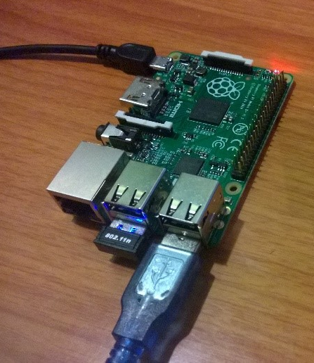

# Setup Raspberry Pi Gateway #
This document explains how to set up a Raspberry Pi as a very simple gateway to read data from sensors connected over Serial, USB, or REST interfaces, and to send that data without change over AMQP to Azure. 
It assumes that you have the right tools installed and that you have cloned or downloaded the ConnectTheDots.io project on your machine.

This configuration creates is very basic - it does not provide any functions such as device management, authentication, or access control. As such, it should be viewed as part of a Proof of Concept for building an IoT solution, not an integral part of a secure enterprise infrastructure. A recommended configuration will be published shortly.

##Hardware requirements ##
See [Hardware](Hardware.md) file in this folder for hardware requirements.

##Prerequisites ##

To build the project you will need Visual Studio 2013 [Community Edition](http://www.visualstudio.com/downloads/download-visual-studio-vs) or above. You will also need wired Internet access for the device. (Configuration details for wireless connectivity provided below, however wired internet is preferred for ease.)

## Configure the Raspberry Pi ##

* Connect the Raspberry Pi to a power supply, keyboard, mouse, monitor, and Ethernet cable (or Wi-Fi dongle) with an Internet connection.
* Get a Raspbian NOOBS SD Card or download a NOOBS image as per the instructions on [http://www.raspberrypi.org/downloads/](http://www.raspberrypi.org/downloads/)
* Boot the NOOBS SD Card and choose Raspbian (see [http://www.raspberrypi.org/help/noobs-setup/](http://www.raspberrypi.org/help/noobs-setup/) for more information).
* Connect to the Raspberry Pi from your laptop, either via a USB-Serial adapter or via the network via SSH (enable once as per these instructions while booting via a monitor on HDMI and a USB keyboard). To connect using SSH:
    * For Windows, download PuTTY and PSCP from [here](http://www.putty.org/).
    * Connect to the Pi using the IP address of the Pi.
* Once you have connected to the Pi, install on it the Mono runtime (which allows use of .NET) and root certs required for a secure SSL connection to Azure:
    * Run the following from a shell (i.e. via SSH)
    

                  sudo apt-get update 
				  sudo apt-get upgrade 
                  sudo apt-get install mono-complete
                  sudo mozroots --import --ask-remove
				  sudo mozroots --import --machine --ask-remove
				  sudo apt-get -y install python libusb-1.0
				  sudo apt-get -y install python-pip
				  sudo pip install --pre pyusb

* Create a device ID and retreive a connection string for the gateway following the instructions in the [Device Setup](../../DeviceSetup.md) guide.
* Open the `Devices\Gateways\GatewayService\GatewayService.sln` solution in Visual Studio
* In Visual Studio, update `\GatewayService\Gateway\Microsoft.ConnectTheDots.GatewayService\App.config` pasting your device connection string:

	Before:
    
		<IotHubConfig IotHubConnectionString="[IoTHubConnectionString]"/>

	After:
 
		<IotHubConfig IotHubConnectionString="HostName=connectthedotsiothub.azure-devices.net;DeviceId=MyDevice;SharedAccessKey=qCkdQE8wo/9LO9bJRVSWgecHvlmlc/fTRBKhNnN7zMQ="/>

* Use  the file `\Scripts\RaspberryPi\deploy.cmd` to copy all requisite files from your computer to the Pi. To use the .CMD file, you will need to 
        
    * Update the IP address
    * Change the Putty and Project directories in the .CMD file as necessary
	    * Do not put your project directory in quotations(") as it will cause the PuTTY calls to fail.  You should see the following:
    * Change Configuration to Release or Debug to reflect whether you built the solution to Debug or Release. 

	Once you had edited the above items, run `deploy.cmd` from the command line while in that directory.

	If it ran correctly, you should see the following:

		editing line endings for Pi
		Processing dos2unix for certificate_update.sh
		Processing dos2unix for autorun_install.sh
		Processing dos2unix for kill_all.sh
		Processing dos2unix for deploy_and_start_ctd_on_boot.sh
		Creating GatewayService directory
		Copying Gateway files
		Amqp.Net.dll              | 188 kB | 188.5 kB/s | ETA: 00:00:00 | 100%
		Microsoft.ConnectTheDots. | 17 kB |  17.5 kB/s | ETA: 00:00:00 | 100%
		Microsoft.ConnectTheDots. | 59 kB |  59.5 kB/s | ETA: 00:00:00 | 100%
		Microsoft.ConnectTheDots. | 32 kB |  32.0 kB/s | ETA: 00:00:00 | 100%
		Microsoft.ConnectTheDots. | 81 kB |  81.5 kB/s | ETA: 00:00:00 | 100%
		Microsoft.ConnectTheDots. | 13 kB |  13.0 kB/s | ETA: 00:00:00 | 100%
		Microsoft.ConnectTheDots. | 3 kB |   3.7 kB/s | ETA: 00:00:00 | 100%
		Microsoft.ConnectTheDots. | 25 kB |  25.5 kB/s | ETA: 00:00:00 | 100%
		Newtonsoft.Json.dll       | 495 kB | 495.5 kB/s | ETA: 00:00:00 | 100%
		Newtonsoft.Json.xml       | 471 kB | 471.9 kB/s | ETA: 00:00:00 | 100%
		NLog.config               | 0 kB |   0.9 kB/s | ETA: 00:00:00 | 100%
		NLog.dll                  | 410 kB | 410.5 kB/s | ETA: 00:00:00 | 100%
		NLog.xml                  | 786 kB | 786.5 kB/s | ETA: 00:00:00 | 100%
		Microsoft.ConnectTheDots. | 9 kB |   9.0 kB/s | ETA: 00:00:00 | 100%
		Microsoft.ConnectTheDots. | 9 kB |   9.5 kB/s | ETA: 00:00:00 | 100%
		Microsoft.ConnectTheDots. | 6 kB |   6.5 kB/s | ETA: 00:00:00 | 100%
		copying scripts
		certificate_update.sh     | 1 kB |   1.5 kB/s | ETA: 00:00:00 | 100%
		autorun_install.sh        | 3 kB |   3.5 kB/s | ETA: 00:00:00 | 100%
		kill_all.sh               | 1 kB |   1.7 kB/s | ETA: 00:00:00 | 100%
		deploy_and_start_ctd_on_b | 3 kB |   3.9 kB/s | ETA: 00:00:00 | 100%
		Marking autorun_once.sh and autorun_install.sh as executable
		Run deploy_next.sh for any supplementary sensor files
    
* On the Raspberry Pi, modify /etc/rc.local with nano:
    
		sudo nano /etc/rc.local
 
* When you are in the nano editor, edit rc.local to the following:
    
		# Print the IP address
		_IP=$(hostname -I) || true
		if [ "$_IP" ]; then
		  printf "My IP address is %s\n" "$_IP"
		fi

		export GW_ACCOUNT_HOME=/home/pi
		export GW_HOME=$GW_ACCOUNT_HOME/ctdgtwy
		if [ ! -d $GW_HOME/logs ]
		  then
		   sudo mkdir $GW_HOME/logs
		fi
		sudo echo "$(date) booting..." >> $GW_HOME/logs/booting.log
		$(cd $GW_HOME/ ; sh deploy_and_start_ctd_on_boot.sh) &
		exit 0

* To exit the nano editor use Ctrl-X, and press Y to save the changes. To have the new settings take effect, reboot the Raspberry Pi by cycling the power or by issuing the command 
    
		Sudo reboot

* At this point your Raspberry Pi is ready to be used as a Gateway for sensor devices connected over USB to send their data to Azure Event Hubs.

If you're following the getting started solution, next step is the [Sample website deployment](../../../Azure/WebSite/WebsitePublish.md).

## Wifi ##

If you want to use Wifi instead of Ethernet in your configuration, you can follow [these instructions](WiFi-Configuration.md)

