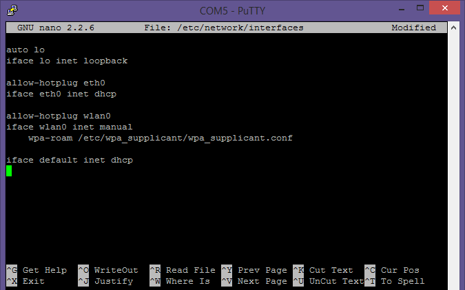

# Wifi Configuration #
In our solution, the Raspberry Pi is most typically run in a headless configuration. When following the labs in your own home or office, you can usually find a keyboard, mouse, and HDMI display to use to connect to the Pi, configure WiFi, and identify the IP address. Or, you can just use a wired connection. In a classroom or lab situation, or when you are working from a laptop using WiFi, this can be more difficult, so we need to use a different approach.

##Prerequisites

Be sure you have installed the latest Raspbian for your Raspberry Pi. Then ensure you have all the latest updates installed as per the instructions here in the Wiki.

On your PC, ensure you have PuTTY, Tera Term, or another suitable terminal client with support for serial connections.

##Using a USB/Serial TTL Cable

Assuming you do not have an HDMI display, and USB mouse and keyboard available, you'll use a USB/Serial TTL cable to access the Pi through a direct serial connection. 

Unplug the Raspberry Pi.

Get yourself one of these great Adafruit cables. Not any cable will work, you will need something that works with your operating system and with the Raspberry Pi. The Adafruit cable works with Windows, including 8+, Linux, OSX. In the Microsoft-run labs, these cables are provided for you.

You can purchase the cable here: http://www.adafruit.com/products/954

Now, connect the cable to the Raspberry Pi. **Do not yet plug it into the USB port on your computer.** We need to make sure there's no power going to the Pi.

I'll show the connection a few different ways here. It's important that you get it correct.

.
 
Use the first +5v pin as shown here. Make sure you're on the outer row of pins -- the row nearest the edge of the board.
Pin 2: +5v
Pin 6: Ground
Pin 8: Pi Transmit (PC receive)
Pin 9: Pi Receive (PC transmit)

.
 
Those are the correct pins for the Pi rev 2, the B+, and the Pi 2. For other versions of the Pi, consult the pin descriptions.

Once you've checked that everything is connected as described here, you may plug the USB connector into your PC. Depending upon the power available in your USB port, and what else you have attached to the Pi, you may be able to power the Raspberry Pi directly from this connection (the +5v wire).

You're not required to do that though. You can plug the Pi into a dedicated power adapter like you normally would. When working with USB WiFi dongles, I recommend you use the standard power connector with a decent (2 amp or more) power supply.

Once plugged in, Windows will detect the adapter and install the driver.
 
.

While the driver is installing, pay attention to the COM port listed. In this case, it's COM5. If you miss that, or if it's been a while since you installed the USB->TTL adapter, you can check device manager. For Windows 8+, right click the start button and select "Device Manager", then look under "Ports (COM & LPT)" as shown here. The port will be listed right in the entry.
 
.

##Connecting to the Pi over Serial

Using PuTTY, Tera Term, or whatever terminal program you choose, start a new serial session. Use the COM port you wrote down during the install. The rate to use is 115200. Other things may be left at typical default values (8 data bits, no parity, 1 stop bit, XON/XOFF flow control, vt100 emulation).

Once connected, hit enter to get to the login prompt.

Note that if you reboot the Pi at any point, you'll get all of the debug boot information through this same connection. Be sure to leave it alone until you get the Linux login prompt, not the recovery login prompt.

##Configuring WiFi

Once you've logged in (default password for Raspbian is user: pi, password: raspberry) over the serial connection, you may configure WiFi and perform other commands.

For our setup, we use wpa_supplicant for wifi. We also use the clear-text passphrase. For use outside of a lab situation, we recommend using the wpa_passphrase command to generate an encrypted passphrase.

For the next step, you'll need to have your network SSID and either your encrypted passphrase or your key from your WiFi router.

At the command line, type:

    sudo nano /etc/wpa_supplicant/wpa_supplicant.conf

Note that the shell has good completion, so you can type "sudo nano /etc/wp{tab}wp{tab}" to get the above if the wpa_supplicant.conf file already exists.

You'll then type this information in. For example, the default information for one of the ZyXel travel routers is shown below.

.
 
When you've entered the required information, hit control-X to exit. You'll be prompted to save, so answer "Y". Just hit enter to save over the old file.

The next step is to edit the `/etc/network/interfaces` file to add in wlan0. To do that, at the command prompt, type:

    sudo nano /etc/network/interfaces

Once edited, your interfaces file should look like this:
 
.

As before, exit nano, saving the file.

Back at the command prompt, type 

    sudo reboot

Remember to ignore the recovery login when you see it come up. Login at the normal Linux login.

##Identifying the IP Address

Now the easy part! To see the network configuration for your pi, at the command line, type:

    ifconfig

If the Pi was able to connect to your WiFi network, you'll see the IP address in the results from that command

.
 
You now know the IP address of your WiFi-connected Raspberry Pi.

##Testing

Once you have confirmed the Pi has a valid IP address, connect to the same subnet as the Pi. (This usually does not work if you're on WiFi, and the Pi is on wired, or vice versa. In most venues, you'll need to get them both on the same network because companies isolate their wired and wireless networks from peer-to-peer communication.)

Open PuTTY or Tera Term and start an SSH session with the IP address you found here. From that point on, you may proceed with the rest of the lab.

You may leave the serial connection open and connected, or shutdown the Pi, and then disconnect the serial cable from the Pi and proceed using SSH only.
