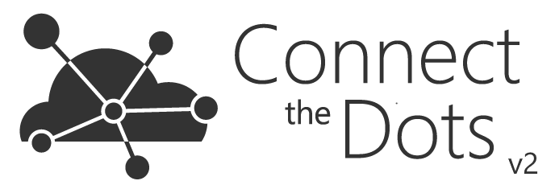
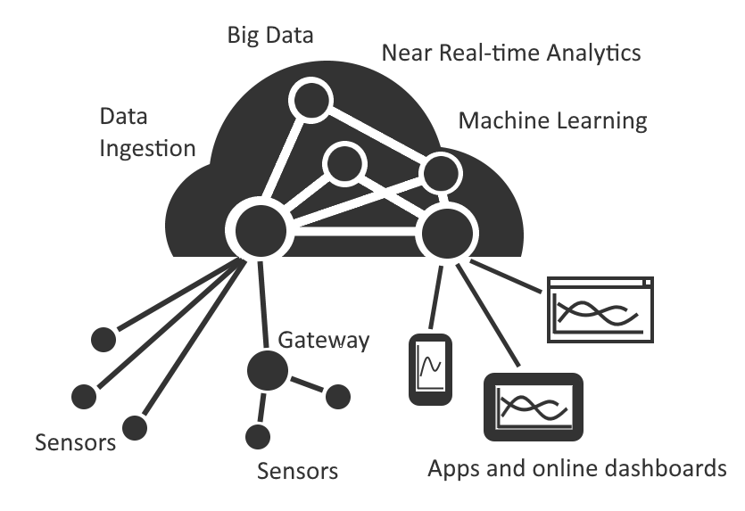

[ConnectTheDots.io](http://connectthedots.io) is an open source project created by Microsoft to help you get tiny devices connected to Microsoft Azure, and to implement great IoT solutions taking advantage of Microsoft Azure advanced analytic services such as Azure Stream Analytics and Azure Machine Learning.

In this project there are code samples, configuration scripts and guides that will help you set up devices and sensors, and configure Microsoft Azure services to view and analyze the data produced by those devices. Some of these samples have been provided by MS Open Tech, others by third parties; we encourage everyone to submit code samples or configuration documentation to grow this project.

This project contains several device samples all aimed at helping you connect your devices to the Azure services, as well as visualize and gain insight from your data.  Check out all the samples below, or follow the getting started walkthrough to learn more.  Then, add some of your devices to the project!

##What Now?##
####[Getting Started](GettingStarted.md)####

If you're new to the project, we recommend the [Getting Started](GettingStarted.md) section which guides you through building a simple temperature sensing network.  

####[Introduction](Introduction.md)####
Visit the [Introduction](Introduction.md) page for more details into how the project works.

####[Available Devices](SupportedDevices.md)####
For a full list of devices and code samples check out the ever growing list of [supported gateways and sensors](SupportedDevices.md).
