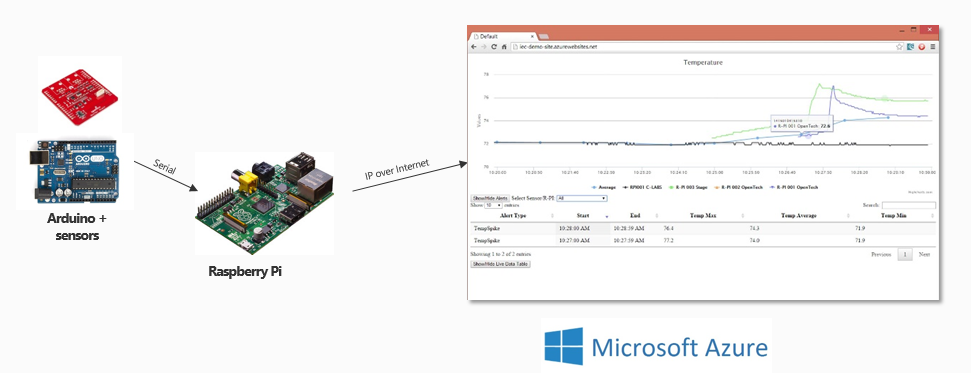

[ConnectTheDots.io](http://connectthedots.io) is an open source project created by <a href="http://msopentech.com">Microsoft Open Technologies</a> to help you get tiny devices connected to Microsoft Azure, and to implement great IoT solutions taking advantage of Microsoft Azure advanced analytic services such as Azure Stream Analytics and Azure Machine Learning. 

In this project there are code samples, configuration scripts and guides that will help you set up devices and sensors, and configure Microsoft Azure services to view and analyze the data produced by those devices. Some of these samples have been provided by MS Open Tech, others by third parties; we encourage everyone to submit code samples or configuration documentation to grow this project.

A good first task, which we are calling the "Connect The Dots starter solution" is to build a simple temperature sensing network. It can be built quickly and easily with minimal knowledge of programming or Microsoft Azure, using commodity devices available locally or online - for example an Arduino UNO board with a weather shield, connected to a Raspberry Pi sending data to an Azure website. 

Sample code for this is included in the project, as well as for many other more elaborate scenarios.

## Device basics ##
The current project is built on the premise that data from sensors is sent to an Azure Event Hub in a prescribed JSON format. The minimum structure, with required attribute names, is 

    {
	"guid" 			:	"string",
	"organization"	:	"string",
	"displayname"	:	"string",
	"location"		:	"string",
	"measurename"	:	"string",
	"unitofmeasure"	:	"string",
	"value" 		:	double/float/integer
	}
	
This should all be sent as one string message to the Event Hub, for example as the following strings: 

    {"guid":"62X74059-A444-4797-8A7E-526C3EF9D64B","organization":"My Org Name","displayname":"Sensor Name","location":"Sensor Location","measurename":"Temperature","unitofmeasure":"F","value":74}

or

    {"guid":"62X74059-A444-4797-8A7E-526C3EF9D64B","organization":"my org name","displayname":"sensor name","location":"sensor location","measurename":"Temperature","unitofmeasure":"F","value":74.0001}

Furthermore, the project is built upon the premise that the *sensors* create and format this JSON string. For example, if using a sensor attached to an Arduino, the code running on the Arduino would send successive JSON strings, CRLF ended, out the serial port to a gateway such as a Raspberry Pi or Windows Tablet. The gateway does nothing other than receive the JSON string, package that into an AMQP message, and send it to Azure. In the case of a directly connected device, the latest needs to send the JSON package to the event hub whether encapsulating the JSON message in an AMQP message or sending the JSON message in a REST packet.

All the device code included in this project, or submitted for inclusion, must conform to the JSON format requirement above. 

## Software prerequisites ##
In order to reproduce one of the ConnectTheDots.io scenarios, you will need the following:

1. Microsoft Azure subscription ([free trial subscription](http://azure.microsoft.com/en-us/pricing/free-trial/) is sufficient)
2. Access to the [Azure Streaming Analytics Preview](https://account.windowsazure.com/PreviewFeatures)
3. Visual Studio 2013 – [Community Edition](http://www.visualstudio.com/downloads/download-visual-studio-vs) or above

## Hardware prerequisites for Connect The Dots starter solution ##
If you are going to deploy the starter solution, you need to procure an Arduino UNO and Raspberry Pi, as shown in the documentation for those devices in the appropriate folders:

- [Arduino UNO R3 and weather shield](Devices/GatewayConnectedDevices/Arduino UNO/Weather/WeatherShieldJson/Hardware.md)
- [Raspberry Pi](Devices/Gateways/GatewayService/Hardware.md)

If you decide to connect another device, you can check out the samples provided in the devices sub folder containing .NET, C++ and Node.js examples. Other languages examples are coming soon! The devices currently showcased are the following:

- Directly connected devices:
    - Intel Galileo running a C++ application and sending data from an Arduino compatible Weather Shield over AMQP
    - Intel Edison running a node.js application sending data from a TI SensorTag BLEn sensor kit over HTTP/REST
    - Gadgeteer device running a C# .Net Micro Framework application sending Gadgeteer sensors data over AMQP
    - Windows Phone C# application sending the phone sensors (light and accelerometer) over HTTP/REST
    - Windows Phone C# application sending a data from a paired Microsoft Band (accelerometer, body temperature, heartbeat)over HTTP/REST
- Gateways:
    - Raspberry Pi supporting several types of device connections (see below) and running a C# service on top of Mono sending data over AMQP
- Gateway connected devices (devices connecting to a gateway to send their data)
    - Arduino UNO with one or several of the following sensors
        - Accelerometer Memsic2125
        - Temperature sensor DS18B20
        - Simple sound sensor
        - Sparkfun weather shield
    - Arduino DUE with one or several of the following sensors:
        - Temperature sensor DS18B20
    - Wensn Sound Level Meter connected to the Gateway over USB

For all the above mentioned devices setup instructions, see the next section below, Step 3 (Device Setup).

## Setup Tasks ##
Setting up your IoT solution involves several distinct steps, each of which is fully described in this project:

1. Clone or copy the project to your machine (NOTE: place the project in a folder as close to the root of your file system as possible. Some paths in the project are very long and you might encounter issues with long path names when restoring NuGet packages)
1. [Azure prep](Azure/AzurePrep/AzurePrep.md) - Creating basic Azure resources
1. [Device setup](Devices/DeviceSetup.md) - Configuring your device(s)
1. [Sample website deployment](Azure/WebSite/WebsitePublish.md) - Publishing a generic sample website for viewing the data
1. [Analysis services setup](Azure/StreamAnalyticsQueries/SA_setup.md) - Configuring Azure Stream Analytics services (for starter solution)
  
To get started with a simple example, complete the "Connect The Dots starter solution" tasks identified in each of the above steps.

## Run the scenario ##

Once you have setup the services, published the site, provisioned and connected your devices, you will see data coming up on your website at the URL you chose when deploying the site.

You should see average temperature measurements showing up in the web browser every 20 seconds.

If you select “All”, you should see raw readings from the device coming in every second.
If the temperature exceeds 75 degrees (F), you should see an alert showing in the alerts table, once every 20 seconds while the temperature on any of the devices exceeds 75 degrees (F).
If you cover the shield, you will see an alert telling you the light is turned off.

